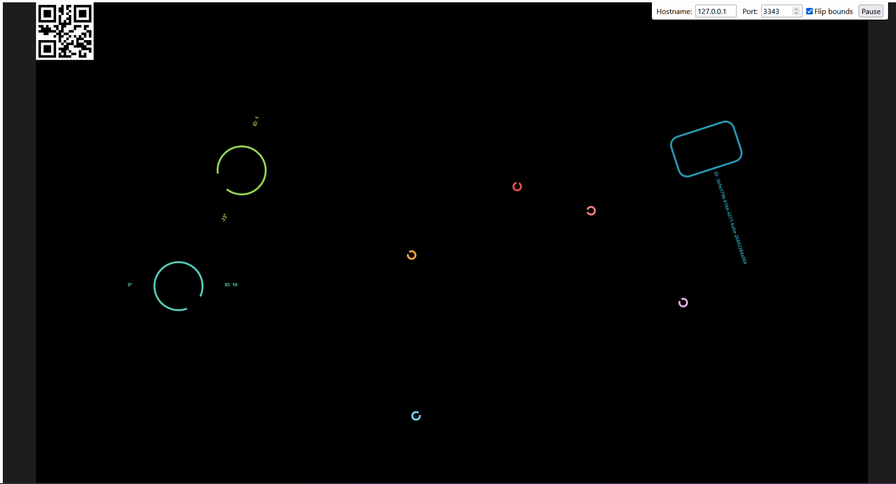

# TUIO Web-Examples

This Repository contains some example projects which demonstrate how to use the [TUIO JavaScript/TypeScript client](https://github.com/InteractiveScapeGmbH/tuio_client_js).



### Simulating TUIO touches and objects

You can use this [TUIO simulator](https://github.com/InteractiveScapeGmbH/tuio-simulator) to simulate touches and objects. Configure it to use WebSocket as the connection type and, TUIO2 as the TUIO version and e.g., port 3343. 

## Setup
```
git clone https://github.com/InteractiveScapeGmbH/tuio-web-examples.git
cd tuio-web-examples
```

### TUIO example with "Vanilla" JavaScript using Vite
```
cd tuio-vite-js
npm install
npm run dev
```

#### TUIO example with TypeScript using Vite
```
cd tuio-vite-ts
npm install
npm run dev
```

#### TUIO example with React and TypeScript using Vite


```
cd tuio-vite-react-ts
npm install
npm run dev
```
